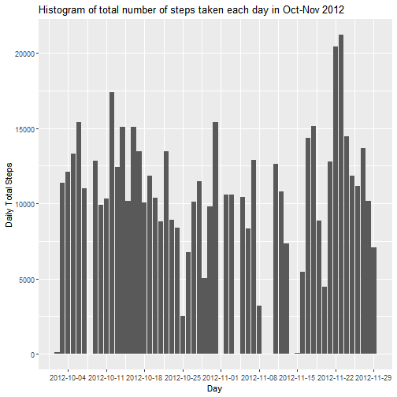
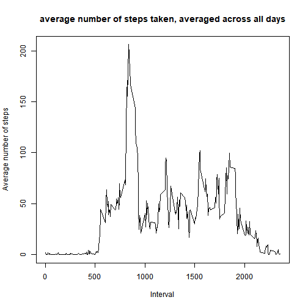
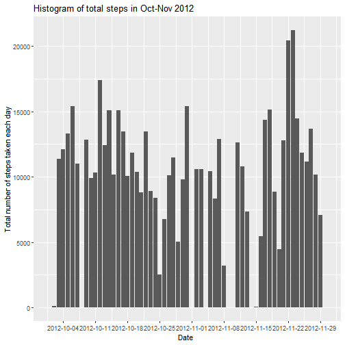
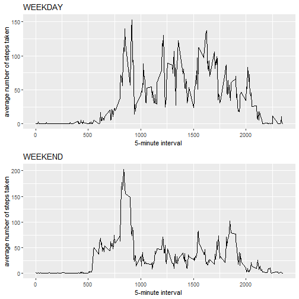

## Loading and preprocessing the data

1. opens CSV file and saves dataset in a new variable called activity. Removes all NA entries. Set date column values as Date format.


```r
        # Opens CSV file and stores data in new variable - activity.
        activity <- read.csv("activity.csv")
        # Remove rows with NA values
        CleanActivity <- activity[complete.cases(activity), ]
        # Set date values format as Date
        CleanActivity$date <- as.Date(CleanActivity$date)
        #show Summary info
        summary(CleanActivity)
```

```
##      steps             date               interval     
##  Min.   :  0.00   Min.   :2012-10-02   Min.   :   0.0  
##  1st Qu.:  0.00   1st Qu.:2012-10-16   1st Qu.: 588.8  
##  Median :  0.00   Median :2012-10-29   Median :1177.5  
##  Mean   : 37.38   Mean   :2012-10-30   Mean   :1177.5  
##  3rd Qu.: 12.00   3rd Qu.:2012-11-16   3rd Qu.:1766.2  
##  Max.   :806.00   Max.   :2012-11-29   Max.   :2355.0
```

## What is mean total number of steps taken per day?

1. Calculate total steps per day, using aggregate function.


```r
        # Calculate average number of steps, per day. Input data has no NA values!
        stepsPerDay <- aggregate.data.frame(CleanActivity$steps,by = list(CleanActivity$date),FUN = sum)
        # Set column names as prefered.
        colnames(stepsPerDay) <- c("Date", "TotalSteps") 
```

2. Make histogram of the total number of steps taken each day. X axis has a lable every 7 days


```r
        ggplot(data = stepsPerDay, aes(Date, TotalSteps)) + 
        labs(x = "Day", y = "Daily Total Steps", title = "Histogram of total number of steps taken each day in Oct-Nov 2012") + 
        geom_bar(stat = "Identity") + 
        scale_x_date(breaks = "7 days")
```




3. Calculate and report the mean and median of the total number of steps taken per day


```r
        # Calculate mean value of Total Steps
        meanStepsPerDay <- as.integer(mean(stepsPerDay$TotalSteps))
        # Calculate Median value of Total Steps
        medianStepsPerDay <- median(stepsPerDay$TotalSteps)
```

**Mean** of the total number of steps taken per day is **10766**.  
**Median** of the total number of steps taken per day is **10765**.  

## What is the average daily activity pattern?

1. Calculate average number of steps taken per 5-minute interval


```r
        # Calculate average number of steps, per interval. Input data has no NA values!
        avgStepsperInterval <- aggregate.data.frame(CleanActivity$steps, by = list(CleanActivity$interval),FUN = mean)
        # Set column names as prefered.
        colnames(avgStepsperInterval) <- c("Interval", "AverageSteps") 
```

2. Make a time series plot of the 5-minute interval (x-axis) and the average number of steps taken, averaged across all days (y-axis)


```r
        plot(avgStepsperInterval$Interval,avgStepsperInterval$AverageSteps,type = "l",xlab="Interval", ylab="Average number of steps", main = "average number of steps taken, averaged across all days" )
```



3. Find the 5-minute interval that contains the maximum number of steps


```r
        MaxIntNumSteps <- avgStepsperInterval$Interval[which.max(avgStepsperInterval$AverageSteps)]
```
The 5-minute interval that, on average, contains the maximum number of steps is 835.

## Imputing missing values

1. Calculate and report the total number of missing values in the dataset 


```r
        numbNA <- nrow(activity)-nrow(CleanActivity)
```
Total number of missing values in the dataset is 2304.


2. Devise a strategy for filling in all of the missing values in the dataset. The strategy does not need to be sophisticated. For example, you could use the mean/median for that day, or the mean for that 5-minute interval, etc.

Strategy to fill NA values in column **Steps**: replace NA with 0.


3. Create a new dataset that is equal to the original dataset but with the missing data filled in.


```r
        # Create new dataset, equal to the original and then, replace NA with 0.
        activity_noNA <- activity
        activity_noNA$steps[is.na(activity_noNA$steps)] <- 0
        # Set values in date column as Date format.
        activity_noNA$date <- as.Date(activity_noNA$date)
```

4. Make a histogram of the total number of steps taken each day and Calculate and report the mean and median total number of steps taken per day. Do these values differ from the estimates from the first part of the assignment? What is the impact of imputing missing data on the estimates of the total daily number of steps?


```r
        # Calculate total number of steps per day and save in nem dataset.
        NewstepsPerDay <- aggregate.data.frame(activity_noNA$steps,by = list(activity_noNA$date),FUN = sum)
        # Set column names as preferred.
        colnames(NewstepsPerDay) <- c("Date", "TotalSteps")
        
        # Plot histogram of the total number of steps taken each day.
        ggplot(data = NewstepsPerDay, aes(Date, TotalSteps)) + 
        labs(x = "Date ", y = "Total number of steps taken each day", title = "Histogram of total steps in Oct-Nov 2012") +
        geom_bar(stat = "Identity") + 
        scale_x_date(breaks = "7 days")
```




```r
        # Calculate and report the mean and median total number of steps taken per day
        meanNewStepsPerDay <- as.integer(mean(NewstepsPerDay$TotalSteps))
        medianNewStepsPerDay <- as.integer(median(NewstepsPerDay$TotalSteps))
```
**Mean** of the total number of steps taken per day is **9354**.  
**Median** of the total number of steps taken per day is **10395**.

Both Mean and Meadian values have decreased by filling in all of the missing values in the dataset with 0; **mean** is the most affected by this strategy, as expected.

## Are there differences in activity patterns between weekdays and weekends?

1. Create a new factor variable in the dataset with two levels – “weekday” and “weekend” indicating whether a given date is a weekday or weekend day.


```r
        # Check if date value is weekend. is.weekend function returns TRUE is date is weekend, and FALSE if date is not weekend (weekday)
        activity_noNA$iswkday <- is.weekend(activity_noNA$date)
        # Set new factor variable with two levels: weekday and weekend
        activity_noNA.f <- factor(activity_noNA$iswkday,labels = c("weekday","weekend"))
        # Show how many values are marked as weekday and weekend
        summary(activity_noNA.f)
```

```
## weekday weekend 
##   12960    4608
```


2. Make a panel plot containing a time series plot (type = "l"|) of the 5-minute interval (x-axis) and the average number of steps taken, averaged across all weekday days or weekend days (y-axis). See the README file in the GitHub repository to see an example of what this plot should look like using simulated data.


```r
        # Calculate average
        AvgStpsPerIntv <- aggregate.data.frame(activity_noNA$steps,by = list(activity_noNA$interval, activity_noNA$iswkday),FUN = mean)
        # Set column names as preferred.
        colnames(AvgStpsPerIntv) <- c("Interval", "Weekday","AverageSteps")
        
        # Make a panel plot containing a time series plot of the 5-minute interval (x-axis) and the average number of steps taken, averaged across all weekday days or weekend days (y-axis)
        
        plot1 <- ggplot(AvgStpsPerIntv[AvgStpsPerIntv$Weekday == "TRUE", ], aes(x = Interval, y = AverageSteps)) + 
                geom_line() + 
                labs(x = "5-minute interval ", y = "average number of steps taken", title = "WEEKDAY")
                
        plot2 <- ggplot(AvgStpsPerIntv[AvgStpsPerIntv$Weekday == "FALSE", ], aes(x = Interval, y = AverageSteps)) + 
                geom_line() + 
                labs(x = "5-minute interval ", y = "average number of steps taken", title = "WEEKEND")
        
        multiplot(plot1,plot2, cols=1)
```


